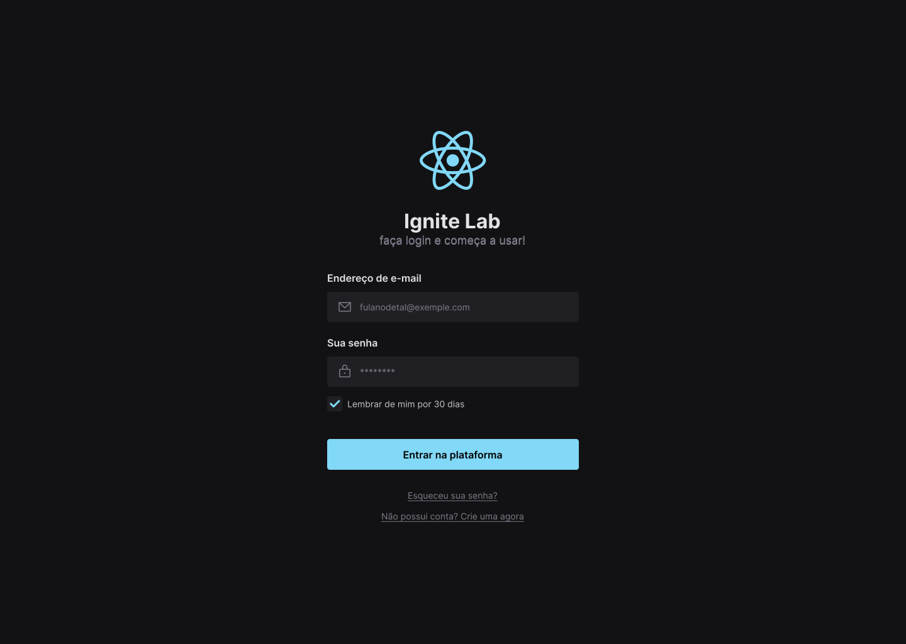

<h1 align="center">
    
</h1>

    

# design-system
project developed to study and practice the storybook

### 🛠 Tecnologias

The following technologies were use:

- [React](https://pt-br.reactjs.org/)
- [Radix UI](https://www.radix-ui.com/)
- [Vite JS](https://vitejs.dev/)
- [Tailwind CSS](https://tailwindcss.com/)
- [Post CSS](https://postcss.org/)
- [Storybook](https://storybook.js.org/)
- [Phosphor icons](https://storybook.js.org/)

some React commands:

### `npm run dev`
Runs the app in the development mode.\
Open [http://localhost:5173](http://localhost:5173) to view it in the browser.

### `npm run storybook`
Runs the storybook docs mode.\
Open [http://localhost:6006](http://localhost:6006) to view it in the browser.
